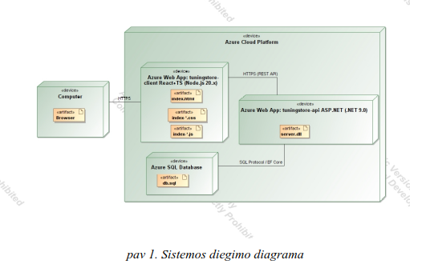
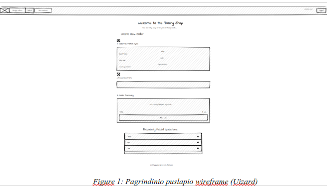
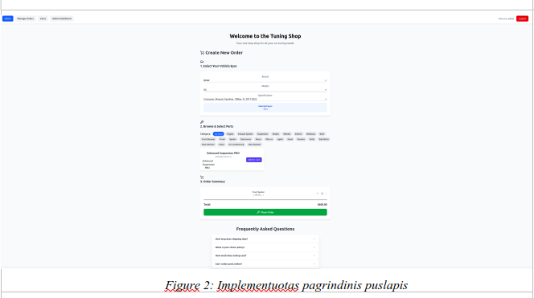
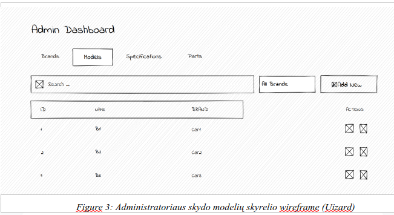
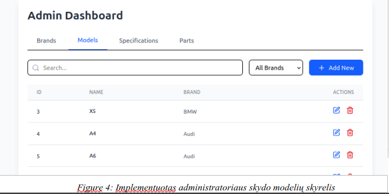
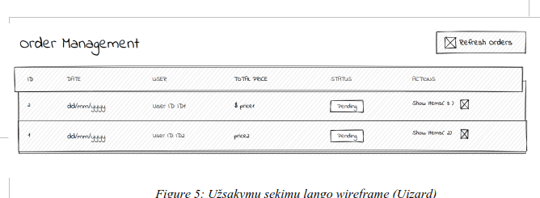
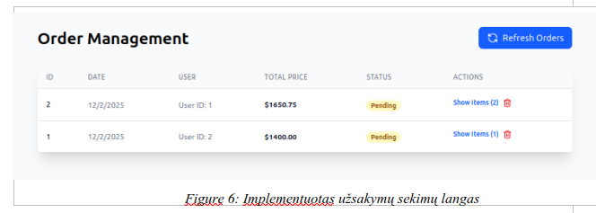
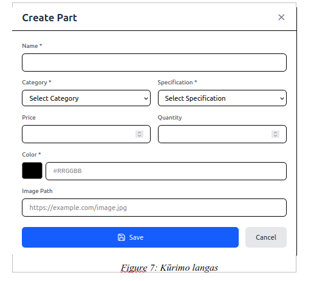

# TuningStore

**Autorius:** Klemensas Barauskas IFF-2/8

---

## Turinys

1. [Sprendžiamo uždavinio aprašymas](#1-sprendžiamo-uždavinio-aprašymas)
   - [Sistemos paskirtis](#sistemos-paskirtis)
   - [Funkciniai reikalavimai](#funkciniai-reikalavimai)
2. [Sistemos architektūra](#2-sistemos-architektūra)
   - [Sistemos sudedamosios dalys](#sistemos-sudedamosios-dalys)
3. [Naudotojo sąsajos projektas](#3-naudotojo-sąsajos-projektas)
4. [OpenAPI specifikacija](#4-openapi-specifikacija)
5. [Instaliavimo instrukcijos](#5-instaliavimo-instrukcijos)
   - [Frontend (React + TypeScript)](#frontend-react--typescript)
   - [Backend (ASP.NET 9.0)](#backend-aspnet-90)
6. [Apibendrinimas](#6-apibendrinimas)

---

## 1. Sprendžiamo uždavinio aprašymas

### Sistemos paskirtis

Projekto tikslas – sukurti patogiai naudojamą automobilio modifikacijų pirkimo platformą, kuri būtų patogiai naudojama vartotojams ir savininkams.

**Veikimas** – platforma kuriama kliento pusės atvaizdavimo principu (angl. _Front-end rendering_). Sistema sudaryta iš dviejų skirtingų serverių:

- Vienas skirtas duomenų atvaizdavimui (Frontend)
- Kitas atlieka pagrindinius skaičiavimus bei komunikuoja su duomenų baze (Backend)

**Sistemos pagrindinis tikslas:**

- **Vartotojams:** Galimybė prisijungus sistemoje savo automobiliui parinkti suderintas modifikacijas be didelių tinkamumo apmąstymų
- **Administratoriams:** Galimybė greitai ir patogiai valdyti modifikacijų suderinamumą

### Funkciniai reikalavimai

#### Neregistruotas sistemos vartotojas galės:

1. Peržiūrėti kontaktinę informaciją ir DUK (dažniausiai užduodamus klausimus)
2. Susikurti paskyrą sistemoje

#### Registruotas sistemos vartotojas galės:

1. Prisijungti prie sistemos
2. Atsijungti nuo sistemos
3. Pirkti modifikacijų komplektą pasirinktam automobiliui

#### Administratorius galės:

1. Atlikti CRUD (Create, Read, Update, Delete) operacijas:
   - Markių, modelių, specifikacijų lentelėse
   - Detalių, modifikacijų (kainos, kiekiai, spalvos, kategorijos)
2. Pridėti bei pašalinti administratorius

---

## 2. Sistemos architektūra

### Sistemos sudedamosios dalys

- **Kliento pusė (Front-End):** React.js su TypeScript
- **Serverio pusė (Back-End):** ASP.NET 9.0
- **Duomenų bazė:** Azure SQL Database

**Sistemos talpinimas:**

- Sistema talpinama Azure serveryje
- Svetainė pasiekiama per HTTP/HTTPS protokolą
- Komunikacija tarp duomenų bazės ir API serverio naudoja Entity Framework ORM sąsają

**Repozitorijos:**

- **Klientas:** [https://github.com/CloSpex/client_tuning_shop](https://github.com/CloSpex/client_tuning_shop)
- **Serveris:** [https://github.com/CloSpex/server_tuning_shop](https://github.com/CloSpex/server_tuning_shop)

## 

## 3. Naudotojo sąsajos projektas









---

## 4. OpenAPI specifikacija

OpenAPI specifikacijos failą (`v1.yaml.json`) galima rasti projekto repozitorijoje:  
[https://github.com/CloSpex/server_tuning_shop/blob/main/v1.yaml.json](https://github.com/CloSpex/server_tuning_shop/blob/main/v1.yaml.json)

### API dokumentacijos pavyzdys

#### GET /api/Parts - Gauti visas detales

**Responses:**

- `200 OK` - Grąžina detalių sąrašą
- `401 Unauthorized` - Vartotojas neautentifikuotas
- `403 Forbidden` - Neturi prieigos teisių
- `500 Internal Server Error` - Serverio klaida

**Response Schema (PartDto):**

```json
{
  "id": 1,
  "name": "M Performance Exhaust",
  "price": 2499.99,
  "color": "#1a1a1a",
  "quantity": 5,
  "imagePath": "images/exhaust.jpg",
  "carSpecificationId": 1,
  "partCategoryId": 1,
  "createdBy": 1,
  "createdAt": "2024-01-15T10:30:00Z",
  "updatedAt": "2024-01-15T10:30:00Z"
}
```

#### GET /api/Parts/{id} - Gauti vieną detalę

**Parameters:**

- `id` (path, required) - Detalės ID (integer)

**Responses:**

- `200 OK` - Grąžina detalės informaciją
- `404 Not Found` - Detalė nerasta
- `401 Unauthorized` - Vartotojas neautentifikuotas
- `403 Forbidden` - Neturi prieigos teisių

## 

## 5. Instaliavimo instrukcijos

### Prieš pradedant

Įsitikinkite, kad turite įdiegtus:

- **Node.js 20** arba naujesnę versiją
- **.NET 9.0 SDK**
- **Azure SQL Database** arba lokalią SQL Server instaliaciją

### Frontend (React + TypeScript)

#### 1. Klonuokite repozitoriją

```bash
git clone https://github.com/CloSpex/client_tuning_shop.git
cd client_tuning_shop
```

#### 2. Įdiekite priklausomybes

```bash
npm install
```

#### 3. Sukonfigūruokite aplinkos kintamuosius

Sukurkite `.env` failą projekto šakniniame kataloge:

```env
VITE_API_URL=http://localhost:5099
```

#### 4. Paleiskite development serverį

```bash
npm run dev
```

Frontend aplikacija bus pasiekiama adresu: `http://localhost:5173`

#### 5. Build production versijai

```bash
npm run build
```

#### Pagrindinės priklausomybės:

- React 19.1.1
- React Router 7.9.0
- Axios 1.12.1
- Tailwind CSS 4.1.17
- TypeScript 5.8.3
- Vite 7.1.2

### Backend (ASP.NET 9.0)

#### 1. Klonuokite repozitoriją

```bash
git clone https://github.com/CloSpex/server_tuning_shop.git
cd server_tuning_shop
```

#### 2. Sukonfigūruokite appsettings.json

Atnaujinkite `appsettings.json` failą su savo duomenimis:

```json
{
  "ConnectionStrings": {
    "DefaultConnection": "Server=your-server.database.windows.net;Database=TuningStore;User Id=your-username;Password=your-password;"
  },
  "AllowedOrigins": "http://localhost:5173",
  "Jwt": {
    "SecretKey": "your-secret-key-min-32-characters",
    "Issuer": "TuningStoreAPI",
    "Audience": "TuningStoreClient",
    "AccessTokenExpirationMinutes": 15,
    "RefreshTokenExpirationDays": 7
  }
}
```

#### 3. Atlikite duomenų bazės migracijas

```bash
dotnet ef database update
```

#### 4. Paleiskite serverį

Development režimu (HTTPS):

```bash
dotnet run --launch-profile https
```

Development režimu (HTTP):

```bash
dotnet run --launch-profile http
```

Backend API bus pasiekiamas adresu:

- HTTPS: `https://localhost:7057`
- HTTP: `http://localhost:5099`

#### 5. Peržiūrėkite API dokumentaciją

Kai serveris veikia development režimu, API dokumentacija prieinama adresu:

```
https://localhost:7057/scalar/v1
```

#### Pagrindinės funkcijos:

- JWT autentifikacija su Refresh Token palaikymu
- Role-based authorization (Admin, User)
- Entity Framework Core su Azure SQL Database
- CORS konfigūracija React aplikacijai
- Scalar API dokumentacija

---

## 6. Apibendrinimas

Projektas vykdo visus nustatytus reikalavimus ir pateikia reikalaujamą OpenAPI dokumentaciją.

**Pagrindiniai pasiekimai:**

- Klientas ir serveris veikia skirtinguose serveriuose
- Palaikoma MVC struktūra
- Įdiegta JWT autentifikacija ir autorizacija
- Sukurta REST API su pilna CRUD funkcionalumu
- Integruota Azure SQL Database
- Dokumentuota API su OpenAPI/Scalar

**Technologijos:**

- Frontend: React 19 + TypeScript + Tailwind CSS
- Backend: ASP.NET 9.0 + Entity Framework Core
- Duomenų bazė: Azure SQL Database
- Autentifikacija: JWT (Access + Refresh tokens)
- API dokumentacija: OpenAPI 3.0 + Scalar UI
